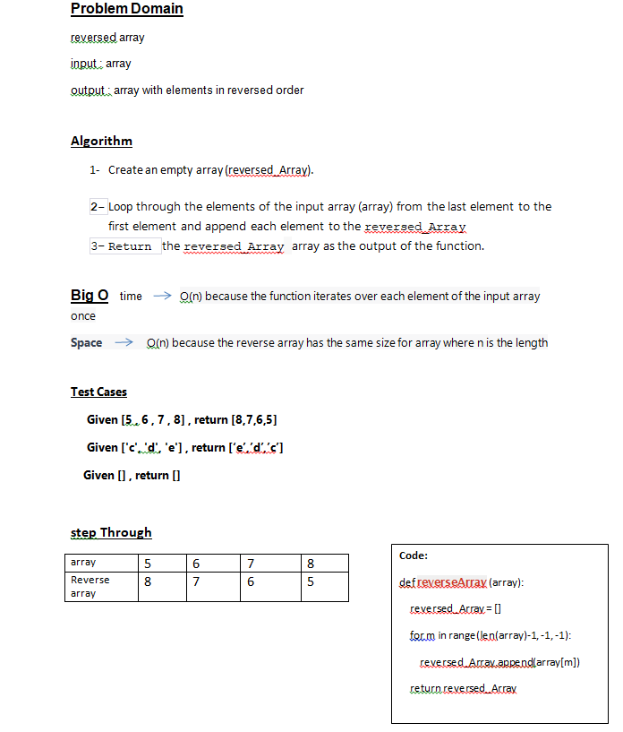

## Reverse Array

## Whiteboard Process

## Approach & Efficiency
1-	Create an empty array (reversed_Array).

2-	Loop through the elements of the input array (array) from the last element to the first element and append each element to the reversed_Array
3-	Return the reversed_Array array as the output of the function.

time 	 O(n) because the function iterates over each element of the input array once
Space 	O(n) because the reverse array has the same size for array where n is the length

## Solution
Given [5 , 6 , 7 , 8] , return [8,7,6,5]
Given ['c', 'd', 'e'] , return [‘e’,’d’,’c’]
Given [] , return []
