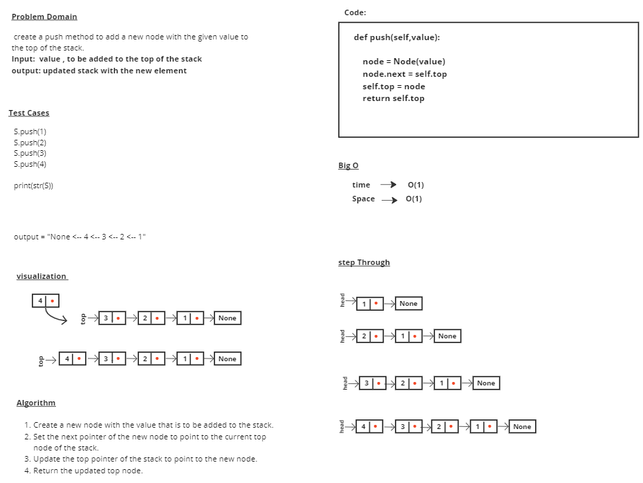
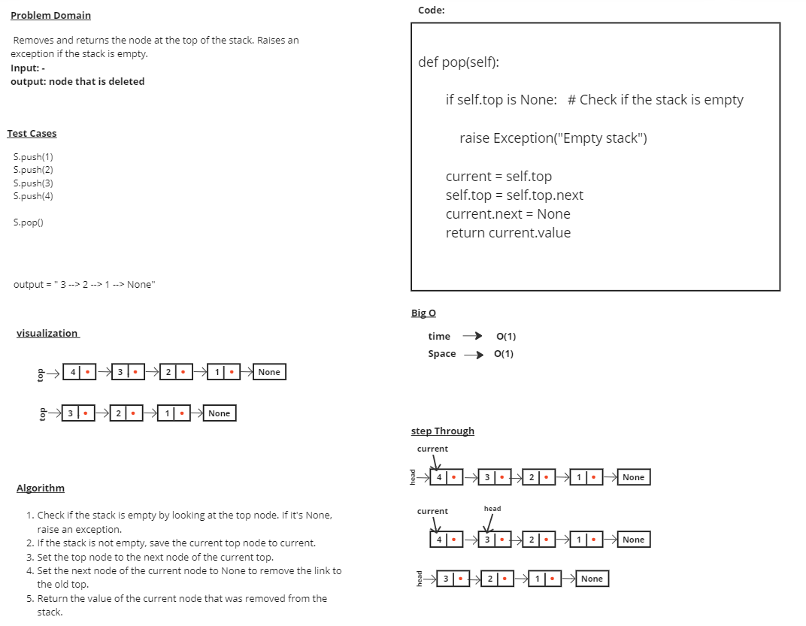
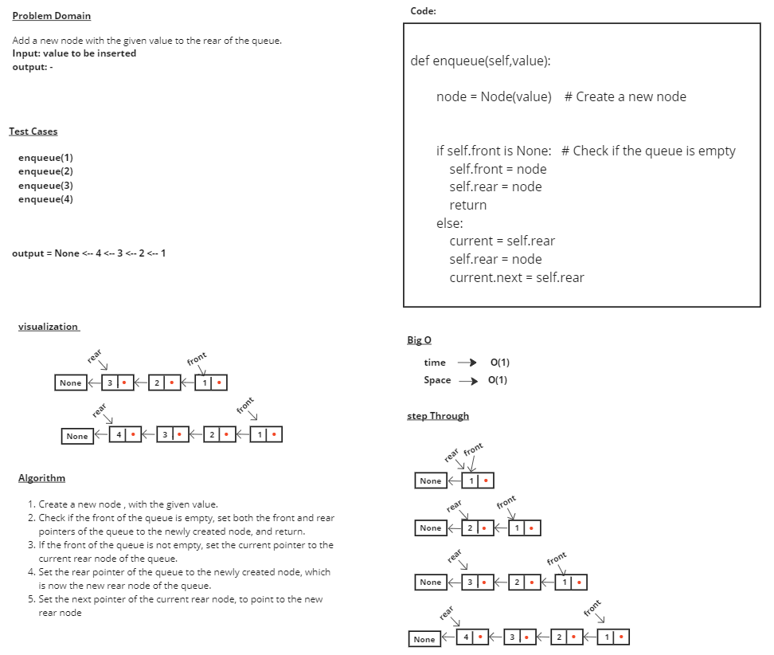
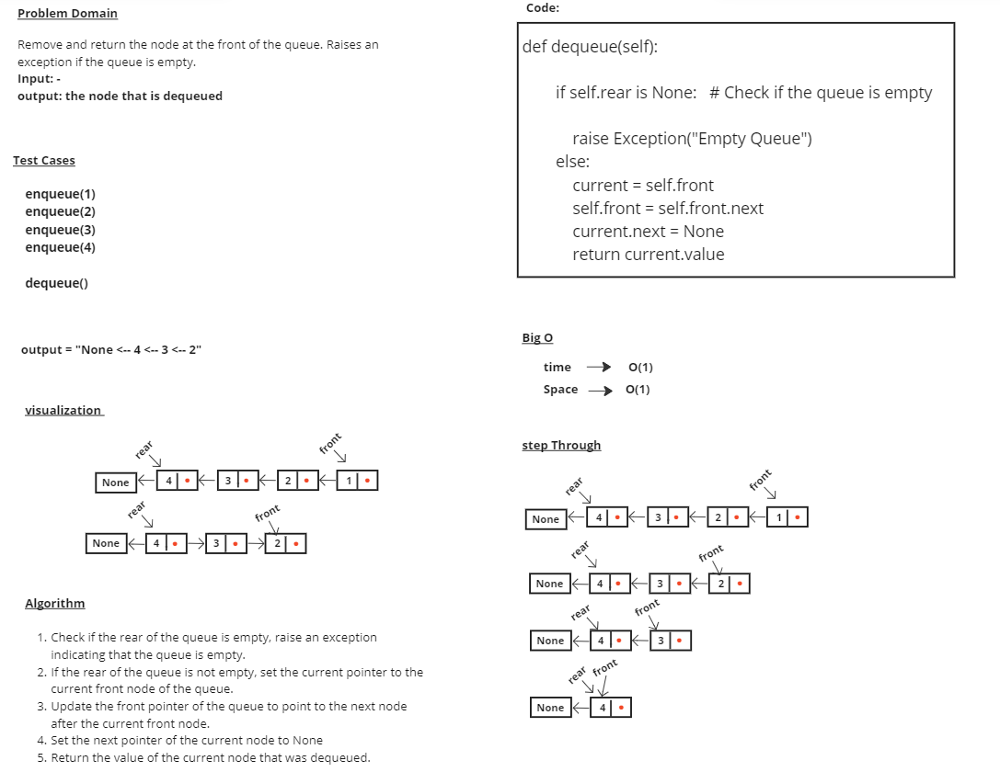

# stack-and-queue

# Whiteboard Process

# Approach & Efficiency
## push
### 1- Create a new node with the given value.
### 2- Set the next pointer of the new node to point to the current top node of the stack.
### 3- Update the top pointer of the stack to point to the new node.
### 4- Return the new top node.

## pop 
### 1- Check if the stack is empty by looking at the top node. If it's None, raise an exception.
### 2- If the stack is not empty, save the current top node to current.
### 3- Set the top node to the next node of the current top.
### 4- Set the next node of the current node to None to remove the link to the old top.
### 5- Return the value of the current node that was removed from the stack.

## enqueue
### 1- Create a new node , with the given value.
### 2- Check if the front of the queue is empty, set both the front and rear pointers of the queue to the newly created node, and return.
### 3- If the front of the queue is not empty, set the current pointer to the current rear node of the queue.
### 4- Set the rear pointer of the queue to the newly created node, which is now the new rear node of the queue.
### 5- Set the next pointer of the current rear node, to point to the new rear node

## dequeue
### 1- Check if the rear of the queue is empty, raise an exception indicating that the queue is empty.
### 2- If the rear of the queue is not empty, set the current pointer to the current front node of the queue.
### 3- Update the front pointer of the queue to point to the next node after the current front node.
### 4- Set the next pointer of the current node to None
### 5- Return the value of the current node that was dequeued.

## time --> O(1)
## Space --> O(1) 

# Solution

### S = Stack()

### S.push(1)
### S.push(2)
### S.push(3)
### S.push(4)

### print(str(S))
### print(S.pop())

### print(S.is_empty())
### print(S.peek())

## output = 4 --> 3 --> 2 --> 1 --> None
            4
           False
           3