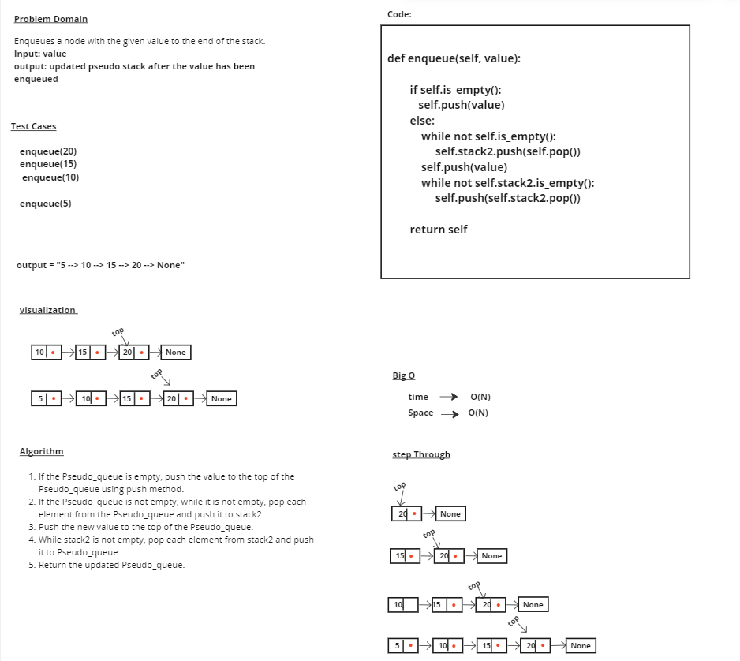
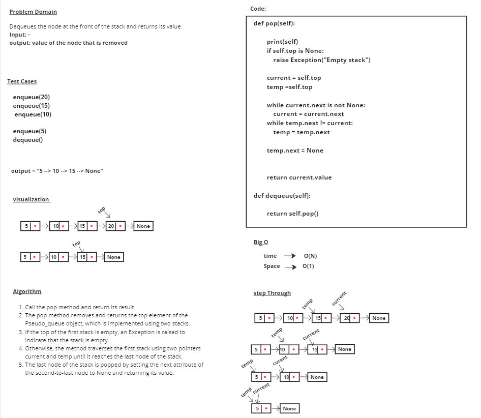

# stack-queue-pseudo

# Whiteboard Process

# Approach & Efficiency
## enqueue
### 1- If the Pseudo_queue is empty, push the value to the top of the Pseudo_queue using push method.
### 2- If the Pseudo_queue is not empty, while it is not empty, pop each element from the Pseudo_queue and push it to stack2.
### 3- Push the new value to the top of the Pseudo_queue.
### 4- While stack2 is not empty, pop each element from stack2 and push it to Pseudo_queue.
### 5- Return the updated Pseudo_queue.

## time --> O(N)
## Space --> O(N) 

## dequeue
### 1- Call the pop method and return its result.
### 2- The pop method removes and returns the top element of the Pseudo_queue object, which is implemented using two stacks.
### 3- If the top of the first stack is empty, an Exception is raised to indicate that the stack is empty.
### 4- Otherwise, the method traverses the first stack using two pointers current and temp until it reaches the last node of the stack.
### 5- The last node of the stack is popped by setting the next attribute of the second-to-last node to None and returning its value.

## time --> O(N)
## Space --> O(1) 

# Solution

      S1 = Pseudo_queue()

      S1.enqueue(20)
      S1.enqueue(15)
      S1.enqueue(10)
   
      S1.enqueue(5)
      S1.dequeue()

      print(str(S1))

## output = 5 --> 10 --> 15 --> 20 --> None
            5 --> 10 --> 15 --> None
           