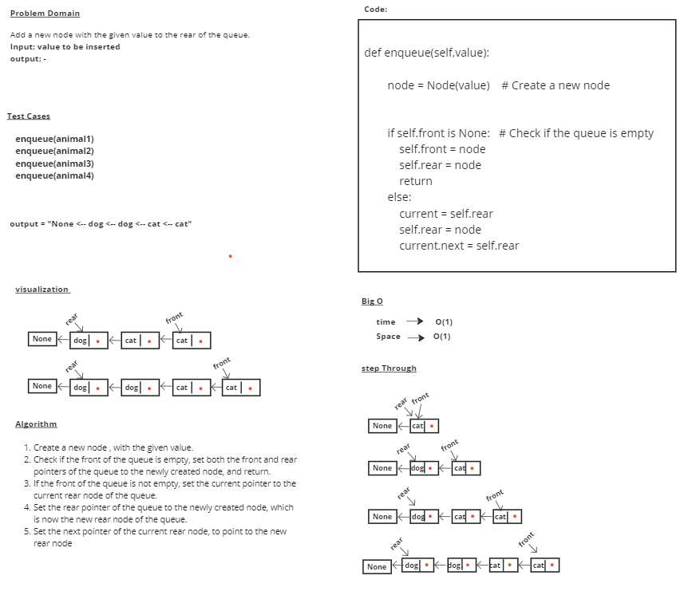
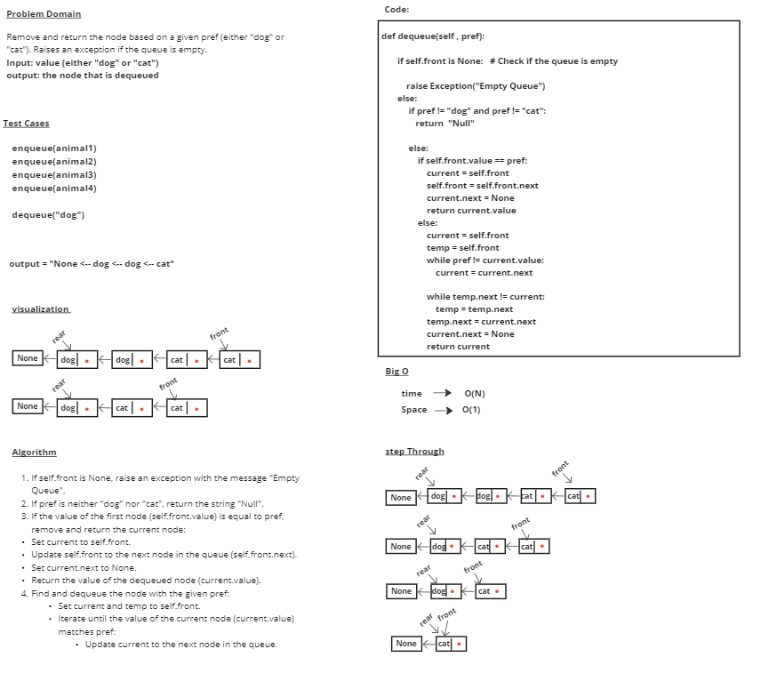

# stack-queue-animal-shelter

# Whiteboard Process

# Approach & Efficiency
## enqueue
### 1- If the Pseudo_queue is empty, push the value to the top of the Pseudo_queue using push method.
### 2- If the Pseudo_queue is not empty, while it is not empty, pop each element from the Pseudo_queue and push it to stack2.
### 3- Push the new value to the top of the Pseudo_queue.
### 4- While stack2 is not empty, pop each element from stack2 and push it to Pseudo_queue.
### 5- Return the updated Pseudo_queue.

## time --> O(N)
## Space --> O(N) 

## dequeue
### 1- If self.front is None, raise an exception with the message "Empty Queue".
### 2- If pref is neither "dog" nor "cat", return the string "Null".
### 3- If the value of the first node (self.front.value) is equal to pref, remove and return the current node:
     Set current to self.front.
     Update self.front to the next node in the queue (self.front.next).
     Set current.next to None.
     Return the value of the dequeued node (current.value).
### 4- Find and dequeue the node with the given pref:
     Set current and temp to self.front.
     Iterate until the value of the current node (current.value) matches pref:
     Update current to the next node in the queue.

## time --> O(N)
## Space --> O(1) 

# Solution

    animal1 = animal("cat","lila1")
    animal2 = animal("cat","lila2")
    animal3 = animal("dog","dody1")
    animal4 = animal("dog","dody2")
    animal5 = animal("dog","dody3")

    A1 = AnimalShelter()
    A1.enqueue(animal1)
    A1.enqueue(animal2)
    A1.enqueue(animal3)
    A1.enqueue(animal4)
    print(A1)

    A1.dequeue("cat")
    print(A1)

    A1.enqueue(animal5)
    print(A1)

    A1.dequeue("dog")
    print(A1)

## output = 
            None <-- dog <-- dog <-- cat <-- cat
            None <-- dog <-- dog <-- cat
            None <-- dog <-- dog <-- dog <-- cat
            None <-- dog <-- dog <-- cat
           