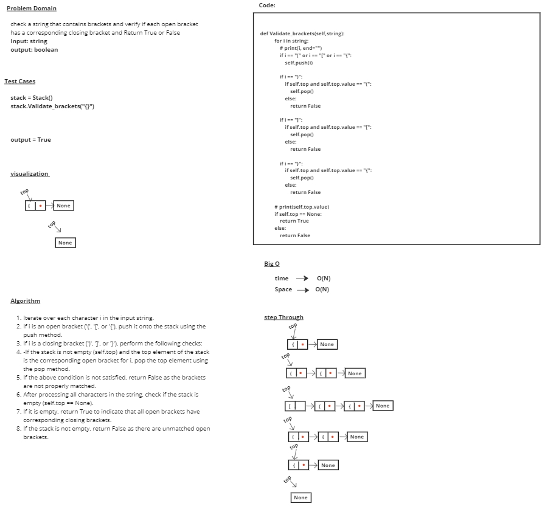

# stack-queue-animal-shelter

# Whiteboard Process

# Approach & Efficiency
## enqueue
### 1- Iterate over each character i in the input string.
### 2- If i is an open bracket ('(', '[', or '{'), push it onto the stack using the push method.
### 3- If i is a closing bracket (')', ']', or '}'), perform the following checks:
### 4- If the stack is not empty (self.top) and the top element of the stack is the corresponding open bracket for i, pop the top element using the pop method.
### 5- If the above condition is not satisfied, return False as the brackets are not properly matched.
### 6- After processing all characters in the string, check if the stack is empty (self.top == None).
### 7- If it is empty, return True to indicate that all open brackets have corresponding closing brackets.
### 8- If the stack is not empty, return False as there are unmatched open brackets.

## time --> O(N)
## Space --> O(N) 

# Solution

        stack.Validate_brackets("()[[Extra Characters]]")
        stack.Validate_brackets("[({}]")

## output = 
            True
            False
           