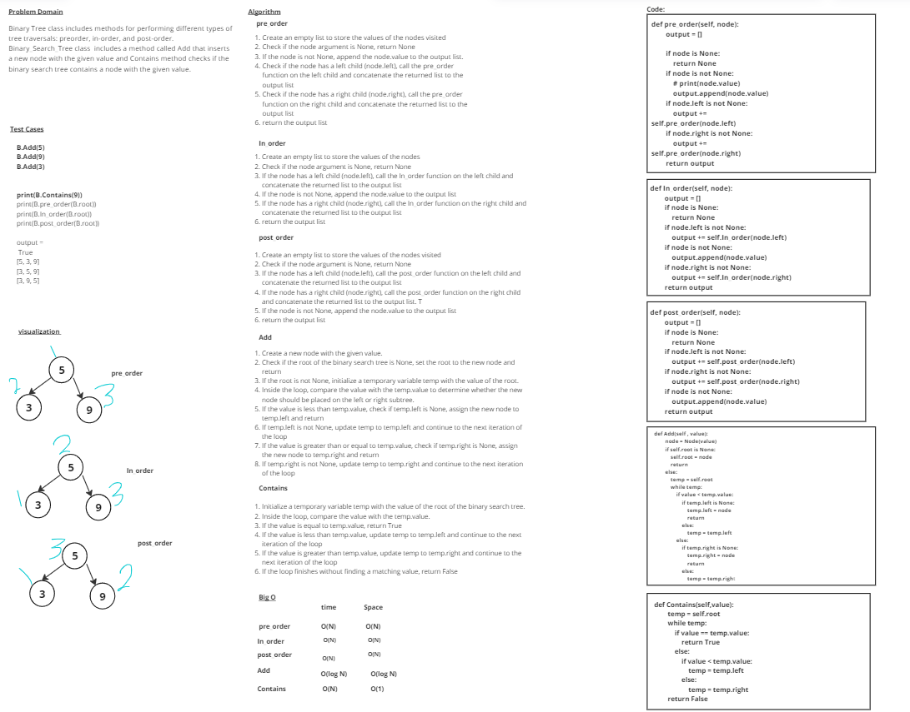

# stack-queue-animal-shelter

# Whiteboard Process

# Solution

        B.Add(5)
        B.Add(9)
        B.Add(3)

        print(B.Contains(9))
        print(B.pre_order(B.root))
        print(B.In_order(B.root))
        print(B.post_order(B.root))

## output = 
            True
            [5, 3, 9]
            [3, 5, 9]
            [3, 9, 5]