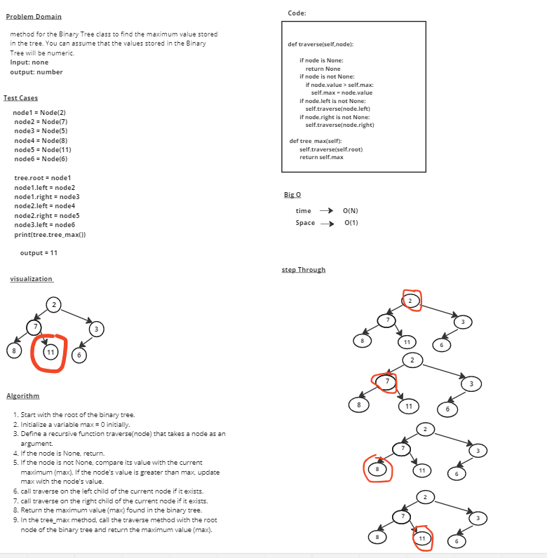

# stack-queue-animal-shelter

# Whiteboard Process

# Approach & Efficiency
## Start with the root of the binary tree.
## Initialize a variable max = 0 initially.
## Define a recursive function traverse(node) that takes a node as an argument.
## If the node is None, return.
## If the node is not None, compare its value with the current maximum (max). If the node's value is greater than max, update max with the node's value.
## call traverse on the left child of the current node if it exists.
## call traverse on the right child of the current node if it exists.
## Return the maximum value (max) found in the binary tree.
## In the tree_max method, call the traverse method with the root node of the binary tree and return the maximum value (max).

## time --> O(N)
## Space --> O(1) 

# Solution

        tree = Binary_Tree()

        node1 = Node(2)
        node2 = Node(7)
        node3 = Node(5)
        node4 = Node(8)
        node5 = Node(11)
        node6 = Node(6)
        
        tree.root = node1
        node1.left = node2
        node1.right = node3
        node2.left = node4
        node2.right = node5
        node3.left = node6

        tree.tree_max()

## output = 
            11
           