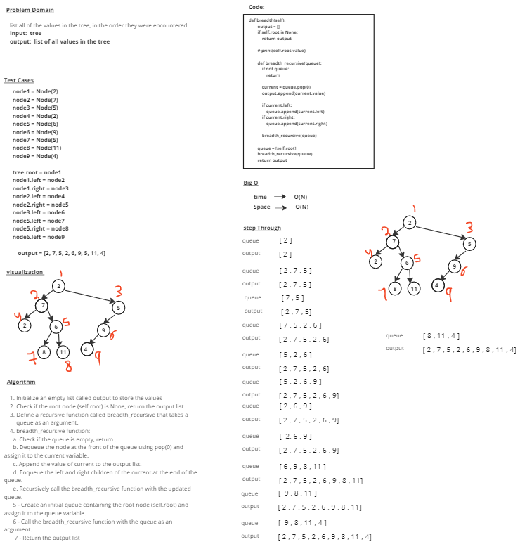

# stack-queue-animal-shelter

# Whiteboard Process

# Approach & Efficiency
### Initialize an empty list called output to store the values 
### Check if the root node (self.root) is None, return the output list
### Define a recursive function called breadth_recursive that takes a queue as an argument.
### breadth_recursive function:
        a. Check if the queue is empty, return .
        b. Dequeue the node at the front of the queue using pop(0) and assign it to the current variable.
        c. Append the value of current to the output list.
        d. Enqueue the left and right children of the current at the end of the queue.
        e. Recursively call the breadth_recursive function with the updated queue.
### Create an initial queue containing the root node (self.root) and assign it to the queue variable.
### Call the breadth_recursive function with the queue as an argument.
### Return the output list

## time --> O(N)
## Space --> O(N) 

# Solution

        tree = Binary_Tree()

        node1 = Node(2)
        node2 = Node(7)
        node3 = Node(5)
        node4 = Node(2)
        node5 = Node(6)
        node6 = Node(9)
        node7 = Node(5)
        node8 = Node(11)
        node9 = Node(4)
        
        tree.root = node1
        node1.left = node2
        node1.right = node3
        node2.left = node4
        node2.right = node5
        node3.left = node6
        node5.left = node7
        node5.right = node8
        node6.left = node9

        tree.breadth()

## output = 
            [2, 7, 5, 2, 6, 9, 5, 11, 4]
           