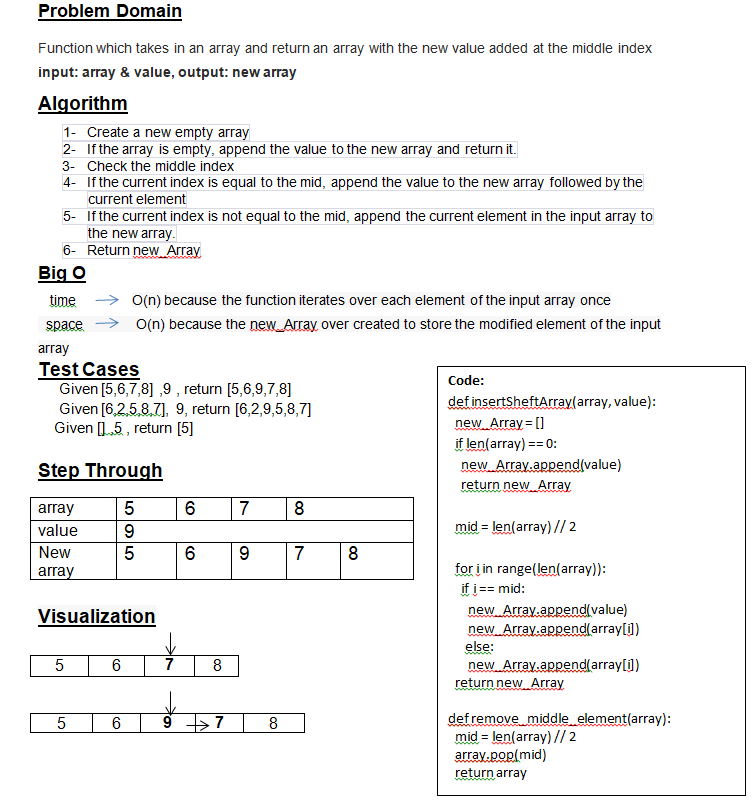

# array-insert-shift

# Whiteboard Process

## Approach & Efficiency
### 1- create a new empty array
### 2- If the array is empty, append the value to the new array and return it.
### 3- Check the middle index 
### 4- If the current index is equal to the mid, append the value to the new array followed by the current element 
### 5- If the current index is not equal to the mid, append the current element in the input array to the new array.
### 6- Return new_Array

##  time :O(n) because the function iterates over each element of the input array once
### space :O(n) because the new_Array over created to store the modified element of the input array

# Solution
### Given [5,6,7,8] ,9 , return [5,6,9,7,8]
### Given [6,2,5,8,7], 9, return [6,2,9,5,8,7]
### Given [] ,5 , return [5]

