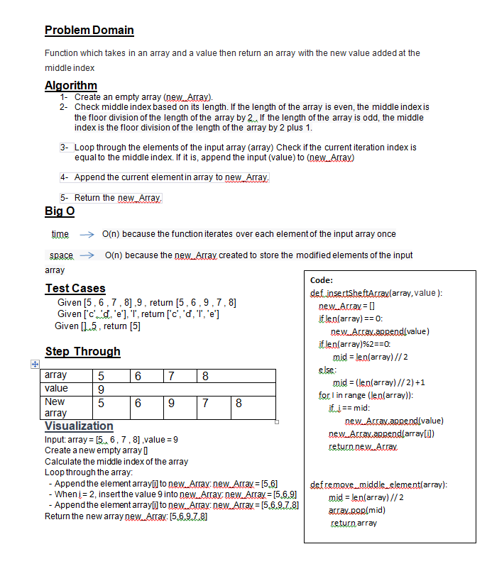

# array-insert-shift

## Whiteboard Process

## Approach & Efficiency
### 1-	Create an empty array (new_Array).
### 2-	Check middle index based on its length. If the length of the array is even, the middle index is the floor division of the length of the array  by 2 . If the length of the array is odd, the middle index is the floor division of the length of the array by 2 plus 1.

### 3-	Loop through the elements of the input array (array) Check if the current iteration index is equal to the middle index. If it is, append the input (value) to (new_Array)

### 4-	Append the current element in array to new_Array.

### 5-	Return the new_Array.

###  time  O(n) because the function iterates over each element of the input array once
###  space 	O(n) because the new_Array created to store the modified elements of the input array

## Solution
### Given [5 , 6 , 7 , 8] ,9 , return [5 , 6 , 9 , 7 , 8]
### Given ['c', 'd', 'e'], 'l', return ['c', 'd', 'l', 'e']
### Given [] ,5 , return [5]

