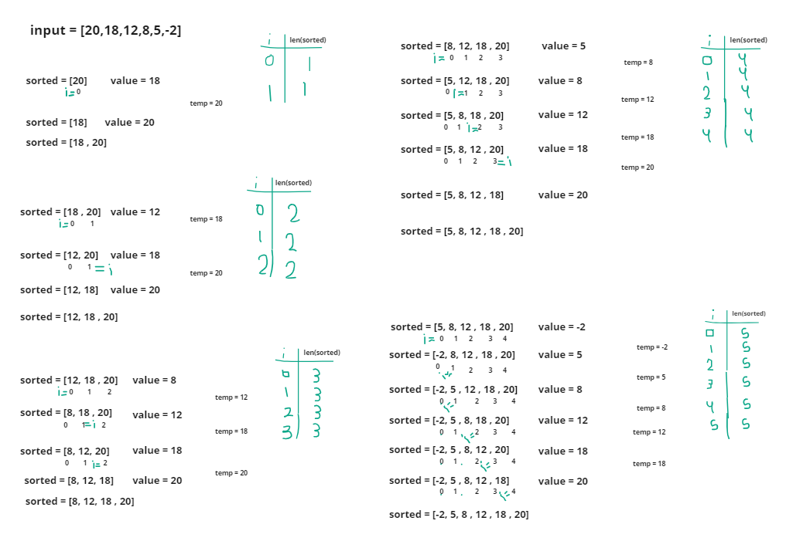

#  Insertion Sort

# Whiteboard Process

# Approach & Efficiency
### Start with an empty list called sorted.
### Iterate over each element in the input list, starting from the second element.
### For each element, find its correct position in the sorted list by comparing it with each element from right to left.
### Shift the elements in the sorted list to the right to make space for the current element.
### Insert the current element into its correct position in the sorted list.
### Repeat steps 3-5 until all elements in the input list are inserted into the sorted list.
### The sorted list will contain all elements from the input list, arranged in ascending order.

## time --> O(N)
## Space --> O(1) 

# Solution

        input = [20,18,12,8,5,-2]
        sorted = InsertionSort(input)

## output = 
        [-2, 5, 8, 12, 18, 20]