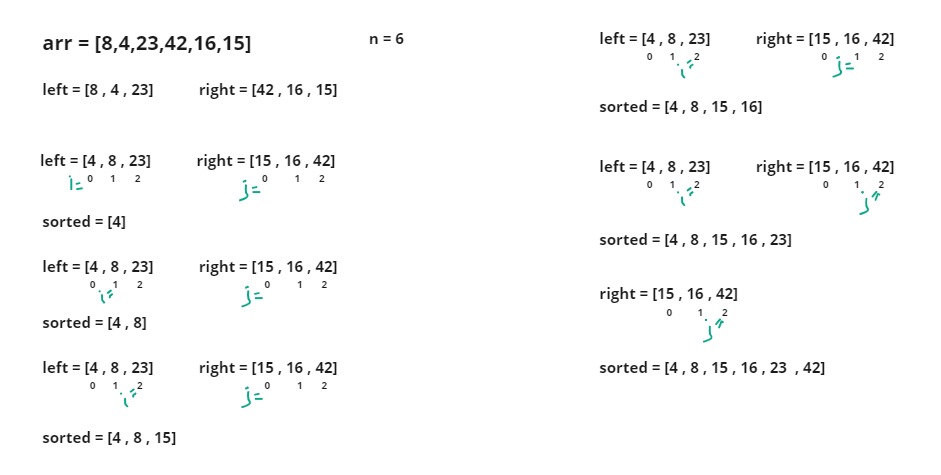

#  Merge Sort

# Whiteboard Process

# Approach & Efficiency
### Calculate the length of the input array arr 
### Check if n is equal to 0 and return  [ ].
### else, calculate the midpoint of the array by integer division: mid = n // 2.
### create a new array left and assign it the elements from index 0 to mid-1 of arr and new array right and assign it the elements from index mid to the end of arr.
### Sort the left and right array using the sort() method
### Call the Merge function with arguments left and right and return the result.
### Initialize variables i, j, and k to 0.
### Create an empty list called sorted.
### Compare the elements at indices i in left and j in right. If left[i] <= right[j], append left[i] to sorted and increment i by 1. Otherwise, append right[j] to sorted and increment j by 1.
### Increment k by 1.
### Repeat steps until either i reaches the length of left or j reaches the length of right.
### If there are remaining elements in left, append them to sorted by iterating from the current value of i to the end of left.
### If there are remaining elements in right, append them to sorted by iterating from the current value of j to the end of right.
### Return the sorted list.

## time --> O(n log n)
## Space --> O(1) 

# Solution

        arr = [8,4,23,42,16,15]
        Mergesort(arr)

## output = 
        [4, 8, 15, 16, 23, 42]