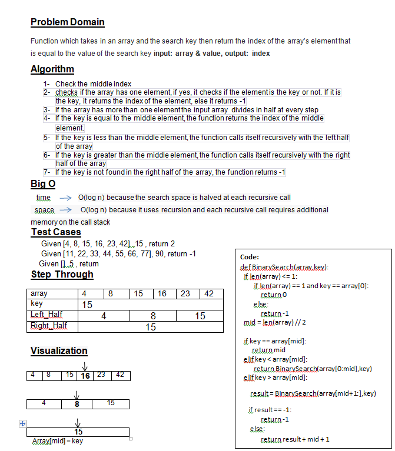

# Whiteboard Process

# Approach & Efficiency
###	Check the middle index 
###	checks if the array has one element, if yes, it checks if the element is the key or not. If it is the key, it returns the index of the element, else it returns -1

###	If the array has more than one element the input array  divides in half at every step
###	If the key is equal to the middle element, the function returns the index of the middle element.
###	If the key is less than the middle element, the function calls itself recursively with the left half of the array
###	If the key is greater than the middle element, the function calls itself recursively with the right half of the array
###	If the key is not found in the right half of the array, the function returns -1

### time :O(log n) because the search space is halved at each recursive call
### space :O(log n) because it uses recursion and each recursive call requires additional 

# Solution
### Given [4, 8, 15, 16, 23, 42] ,15 , return 2
### Given [11, 22, 33, 44, 55, 66, 77], 90, return -1
### Given [] ,5 , return 
