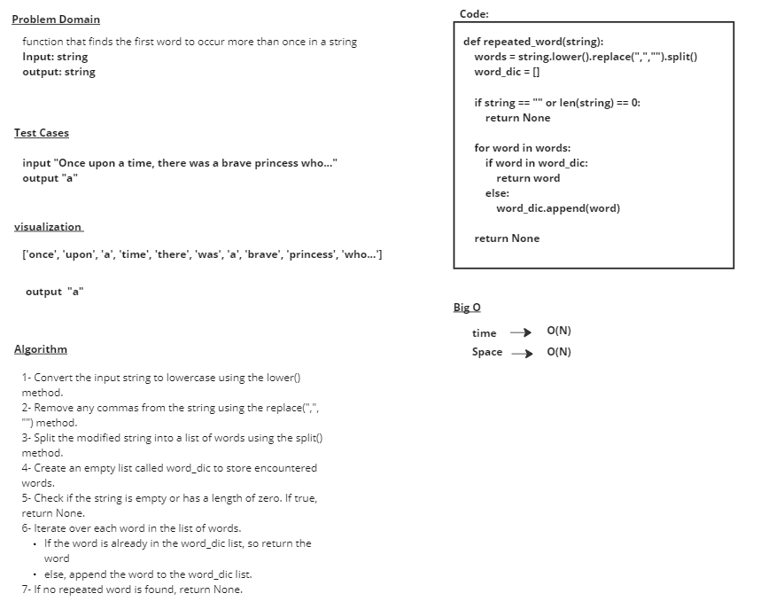

# hashmap-repeated-word

# Whiteboard Process

# Approach & Efficiency
### Convert the input string to lowercase using the lower() method.
### Remove any commas from the string using the replace(",", "") method.
### Split the modified string into a list of words using the split() method.
### Create an empty list called word_dic to store encountered words.
### Check if the string is empty or has a length of zero. If true, return None.
### Iterate over each word in the list of words.
  - If the word is already in the word_dic list, so return the word
  - else, append the word to the word_dic list.
### If no repeated word is found, return None.

## time --> O(N)
## Space --> O(N) 

# Solution

            str1 = "It was a queer, sultry summer, the summer they electrocuted the Rosenbergs, and I didn’t know what I was doing in New York..."

            print(repeated_word(str1))

## output = 
            "summer"
           