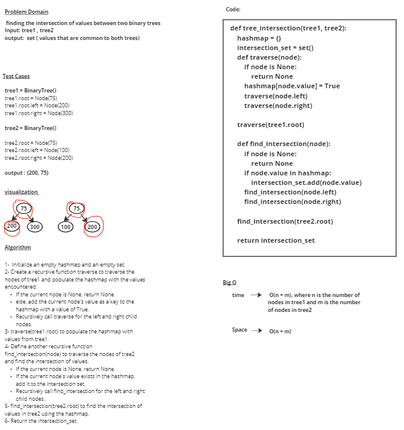

# tree-intersection

# Whiteboard Process

# Approach & Efficiency
### create two empty sets, set1 and set2, to store values
### Define a  function called traverse that takes a node and a set as input.
    - If the node is None, return None.
### Add the value of the node to the set.
### Recursively call traverse on the left child of the node, passing the same set.
### Recursively call traverse on the right child of the node, passing the same set.
### call the traverse function on the root of tree1, passing set1.
### call the traverse function on the root of tree2, passing set2.
### Return the intersection of set1 and set2.

## time --> O(N)
## Space --> O(N) 

# Solution

            tree1 = BinaryTree()

            tree1.root = Node(100)
            tree1.root.left = Node(200)
            tree1.root.right = Node(300)
            tree1.root.left.left = Node(700)
            tree1.root.left.right = Node(125)

            tree2 = BinaryTree()

            tree2.root = Node(150)
            tree2.root.left = Node(100)
            tree2.root.right = Node(200)
            tree2.root.left.left = Node(700)
            tree2.root.left.right = Node(125)
            tree2.root.right.left = Node(75)

            values = tree_intersection(tree1, tree2)

## output = 
            {200, 700, 100, 125}
           