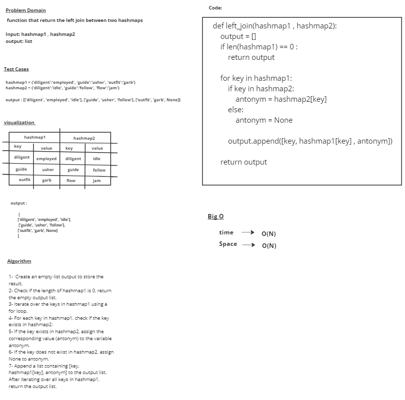

# LEFT JOINs

# Whiteboard Process

# Approach & Efficiency
### Create an empty list output to store the result.
### Check if the length of hashmap1 is 0, return the empty output list.
### Iterate over the keys in hashmap1 using a for loop.
### For each key in hashmap1, check if the key exists in hashmap2:
          If the key exists in hashmap2, assign the corresponding value (antonym) to the variable antonym.
          If the key does not exist in hashmap2, assign None to antonym.
          Append a list containing [key, hashmap1[key], antonym] to the output list. 
### After iterating over all keys in hashmap1, return the output list.

## time --> O(N)
## Space --> O(N) 

# Solution

            hashmap1 = {'diligent':'employed', 'fond':'enamored', 'guide':'usher', 'outfit':'garb', 'wrath':'anger'}
            hashmap2 = {'diligent':'idle', 'fond':'averse', 'guide':'follow', 'flow':'jam', 'wrath':'delight'}

            left_join(hashmap1,hashmap2)

## output = 
        [['diligent', 'employed', 'idle'], ['fond', 'enamored', 'averse'], ['guide', 'usher', 'follow'], ['outfit', 'garb', None], ['wrath','anger', 'delight']]
           