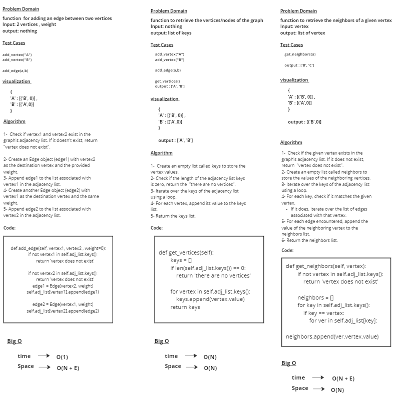

# graph

# Whiteboard Process

# Approach & Efficiency
### Check if vertex1 and vertex2 exist in the graph's adjacency list. If it doesn't exist, return "vertex does not exist".
### Create an Edge object (edge1) with vertex2 as the destination vertex and the provided weight.
### Append edge1 to the list associated with vertex1 in the adjacency list.
### Create another Edge object (edge2) with vertex1 as the destination vertex and the same weight.
### Append edge2 to the list associated with vertex2 in the adjacency list.

## time --> O(1)
## Space --> O(N + E) 

# Approach & Efficiency
### Create an empty list called keys to store the vertex values.
### Check if the length of the adjacency list keys is zero, return the  "there are no vertices".
### Iterate over the keys of the adjacency list using a loop.
### For each vertex, append its value to the keys list.
### Return the keys list.

## time --> O(N)
## Space --> O(N) 

# Approach & Efficiency
### Check if the given vertex exists in the graph's adjacency list. If it does not exist, return  "vertex does not exist".
### Create an empty list called neighbors to store the values of the neighboring vertices.
### Iterate over the keys of the adjacency list using a loop.
### For each key, check if it matches the given vertex.
     If it does, iterate over the list of edges associated with that vertex.
### For each edge encountered, append the value of the neighboring vertex to the neighbors list.
### Return the neighbors list.

## time --> O(N + E)
## Space --> O(N) 

# Solution

            a = graph1.add_vertex("A")
            b = graph1.add_vertex("B")
            c = graph1.add_vertex("C")
            d = graph1.add_vertex("D")

            graph1.add_edge(a,b)
            graph1.add_edge(a,c)
            graph1.add_edge(c,b)
            graph1.add_edge(d,b)
            graph1.add_edge(d,c)

            print(graph1)

            print(graph1.get_vertices())

            print(graph1.get_neighbors(a))

            print(graph1.size())

## output = 
        
        A -> B -----> C -----> 
        B -> A -----> C -----> D -----> 
        C -> A -----> B -----> D -----> 
        D -> B -----> C -----> 

        ['A', 'B', 'C', 'D']

        ['B', 'C']
        
        4