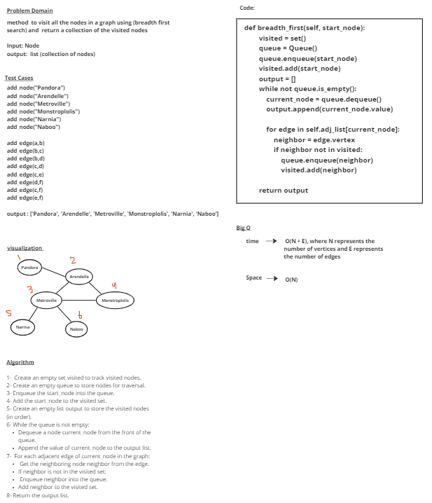

# graph

[tests](../tests/test_cc36.py) 

# Whiteboard Process

# Approach & Efficiency
### Create an empty set visited to track visited nodes.
### Create an empty queue to store nodes for traversal.
### Enqueue the start_node into the queue.
### Add the start_node to the visited set.
### Create an empty list output to store the visited nodes (in order).
### While the queue is not empty:
    Dequeue a node current_node from the front of the queue.
    Append the value of current_node to the output list.
###  For each adjacent edge of current_node in the graph:
    Get the neighboring node neighbor from the edge.
    If neighbor is not in the visited set:
    Enqueue neighbor into the queue.
    Add neighbor to the visited set.
### Return the output list.

## time -->  O(N + E), where N represents the number of vertices and E represents the number of edges
## Space --> O(N) 

# Solution

            add_node("Pandora")
            add_node("Arendelle")
            add_node("Metroville")
            add_node("Monstroplolis")
            add_node("Narnia")
            add_node("Naboo")

            add_edge(a,b)
            add_edge(b,c)
            add_edge(b,d)
            add_edge(c,d)
            add_edge(c,e)
            add_edge(d,f)
            add_edge(c,f)
            add_edge(e,f)

            breadth_first(a)

## output = 
        
        ['Pandora', 'Arendelle', 'Metroville', 'Monstroplolis', 'Narnia', 'Naboo']