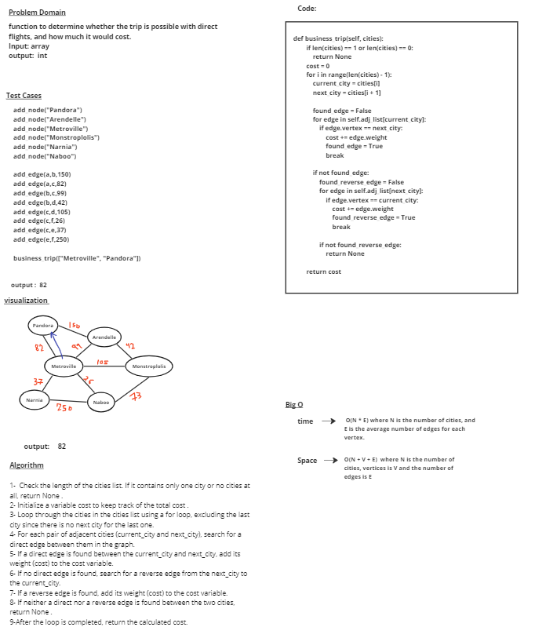

# graph

[tests](../tests/test_cc37.py) 

# Whiteboard Process

# Approach & Efficiency
### Check the length of the cities list. If it contains only one city or no cities at all, return None .
### Initialize a variable cost to keep track of the total cost .
### Loop through the cities in the cities list using a for loop, excluding the last city since there is no next city for the last one.
### For each pair of adjacent cities (current_city and next_city), search for a direct edge between them in the graph.
### If a direct edge is found between the current_city and next_city, add its weight (cost) to the cost variable.
### If no direct edge is found, search for a reverse edge from the next_city to the current_city.
### If a reverse edge is found, add its weight (cost) to the cost variable.
### If neither a direct nor a reverse edge is found between the two cities, return None .
### After the loop is completed, return the calculated cost.

## time -->   O(N * E) where N is the number of cities, and E is the average number of edges for each vertex.
## Space --> O(N + V + E)  where N is the number of cities, vertices is V and the number of edges is E

# Solution

            graph1 = Graph()

            a = graph1.add_node("Pandora")
            b = graph1.add_node("Arendelle")
            c = graph1.add_node("Metroville")
            d = graph1.add_node("Monstroplolis")
            e = graph1.add_node("Narnia")
            f = graph1.add_node("Naboo")

            graph1.add_edge(a,b,150)
            graph1.add_edge(a,c,82)
            graph1.add_edge(b,c,99)
            graph1.add_edge(b,d,42)
            graph1.add_edge(c,d,105)
            graph1.add_edge(c,f,26)
            graph1.add_edge(c,e,37)
            graph1.add_edge(e,f,250)

           graph1.business_trip(["Metroville", "Pandora","Arendelle"])

## output = 
        
        232