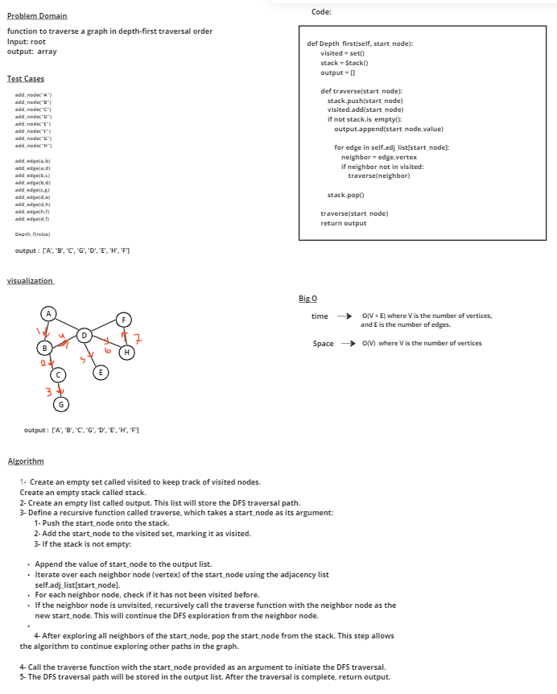

# graph

[tests](../tests/test_cc38.py) 

# Whiteboard Process

# Approach & Efficiency
### Create an empty set called visited to keep track of visited nodes. 
### Create an empty stack called stack. 
### Create an empty list called output. This list will store the DFS traversal path.
### Define a recursive function called traverse, which takes a start_node as its argument:
    a. Push the start_node onto the stack.
    b. Add the start_node to the visited set, marking it as visited.
    c. If the stack is not empty:
        - Append the value of start_node to the output list.
        - Iterate over each neighbor node (vertex) of the start_node using the adjacency list self.adj_list[start_node].
        - For each neighbor node, check if it has not been visited before.
        - If the neighbor node is unvisited, recursively call the traverse function with the neighbor node as the new start_node. This will continue the DFS exploration from the neighbor node.
    d. After exploring all neighbors of the start_node, pop the start_node from the stack. This step allows the algorithm to continue exploring other paths in the graph.
### Call the traverse function with the start_node provided as an argument to initiate the DFS traversal.
### The DFS traversal path will be stored in the output list. After the traversal is complete, return output.

## time -->  O(V + E) where V is the number of vertices, and E is the number of edges.
## Space --> O(V)  where V is the number of vertices 

# Solution

            graph1 = Graph()
            a = graph1.add_node("A")
            b = graph1.add_node("B")
            c = graph1.add_node("C")
            d = graph1.add_node("D")
            e = graph1.add_node("E")
            f = graph1.add_node("F")
            g = graph1.add_node("G")
            h = graph1.add_node("H")

            graph1.add_edge(a,b)
            graph1.add_edge(a,d)
            graph1.add_edge(b,c)
            graph1.add_edge(b,d)
            graph1.add_edge(c,g)
            graph1.add_edge(d,e)
            graph1.add_edge(d,h)
            graph1.add_edge(h,f)
            graph1.add_edge(d,f)

             
            graph1.Depth_first(a)

## output = 
        
        ['A', 'B', 'C', 'G', 'D', 'E', 'H', 'F']