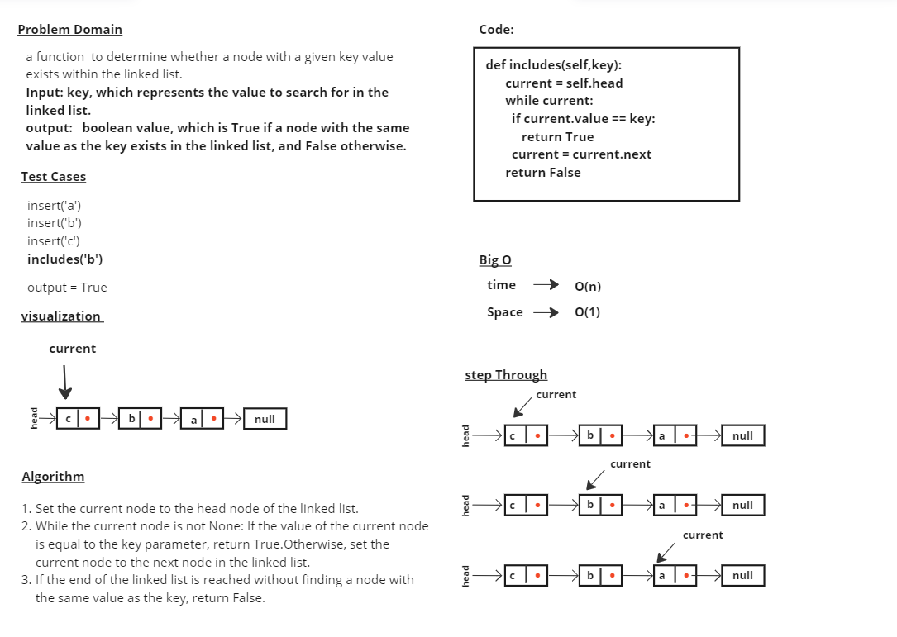
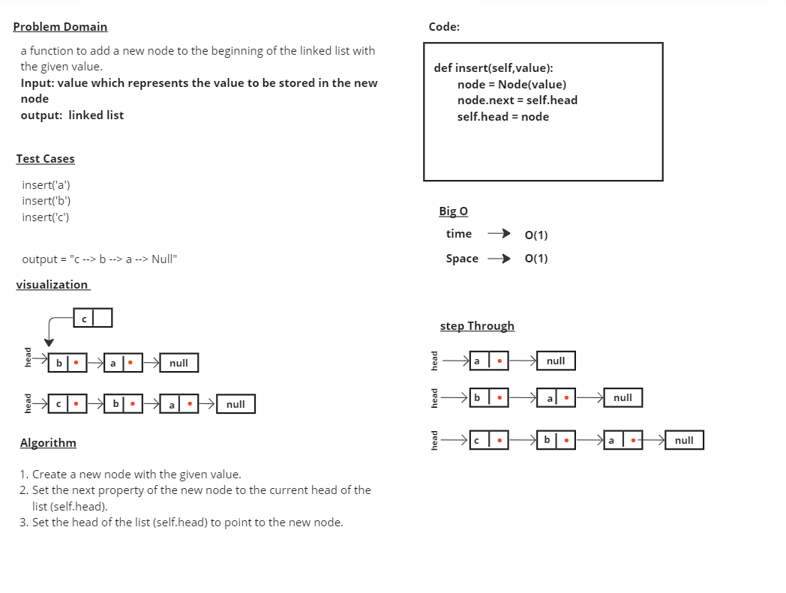

# linked-list

# Whiteboard Process

# Approach & Efficiency
## insert
## 1-	Create a new node with the given value.
## 2-	Set the next property of the new node to the current head of the list (self.head).
## 3-	Set the head of the list (self.head) to point to the new node.

## time --> O(1)
## Space --> O(1)

## includes
## 1-	Set the current node to the head node of the linked list.
## 2-	While the current node is not None: If the value of the current node is equal to the key parameter, return True.Otherwise, set the current node to the next node in the linked list.

## 3-	If the end of the linked list is reached without finding a node with the same value as the key, return False.

## time --> O(n) 
## Space --> O(1) 

# Solution

### insert('a')
### insert('b')
### insert('c')
### output = "c --> b --> a --> Null"

### includes('b')
### output = True
