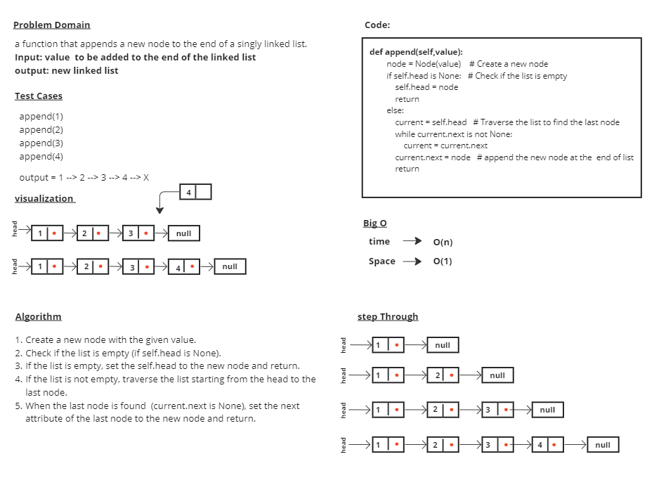
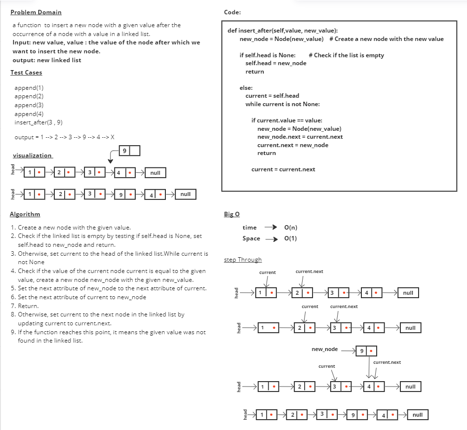
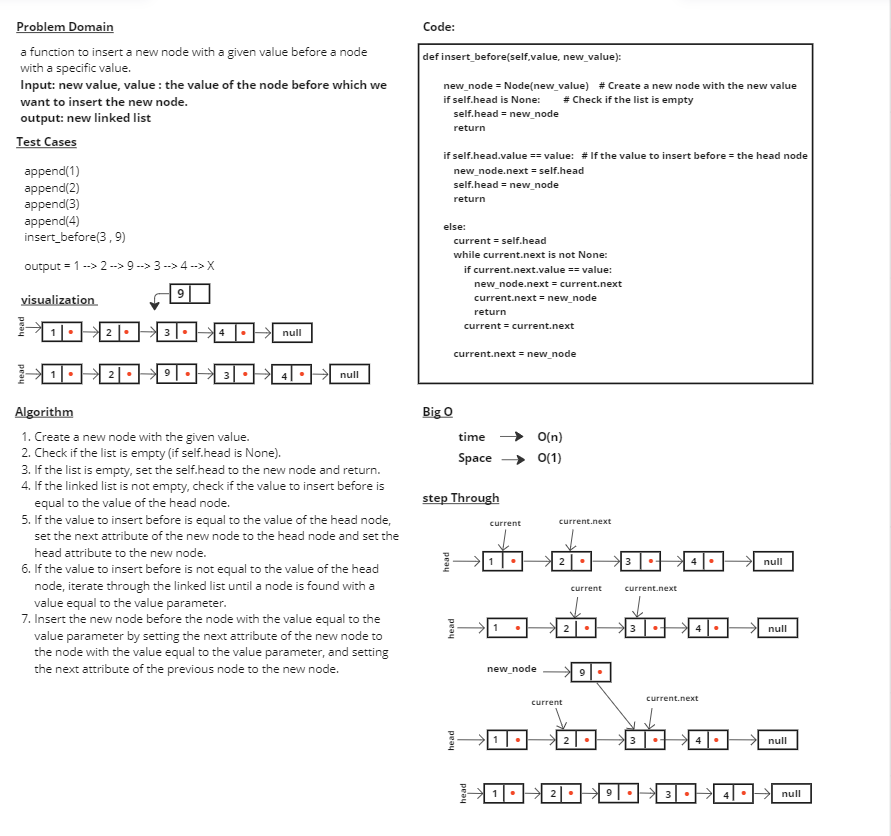
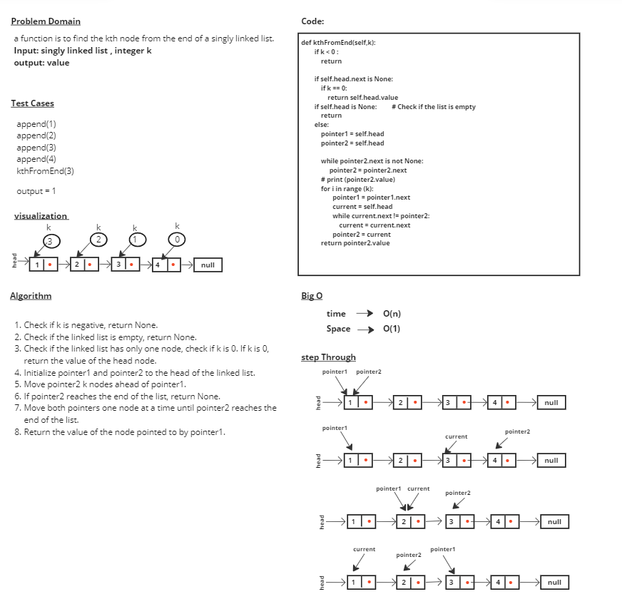

# linked-list-kth

# Whiteboard Process

# Approach & Efficiency
## 1-	Check if k is negative, return None.
## 2-	Check if the linked list is empty, return None.
## 3-	Check if the linked list has only one node, check if k is 0. If k is 0, return the value of the head node.
## 4-	Move pointer2 k nodes ahead of pointer1.
## 5-	If pointer2 reaches the end of the list, return None.
## 6-	Move both pointers one node at a time until pointer2 reaches the end of the list.
## 7-	Return the value of the node pointed to by pointer1.

## time --> O(n) 
## Space --> O(1) 

# Solution

## append(1)
## append(2)
## append(3)
## append(4)
## kthFromEnd(3)

## output = 1