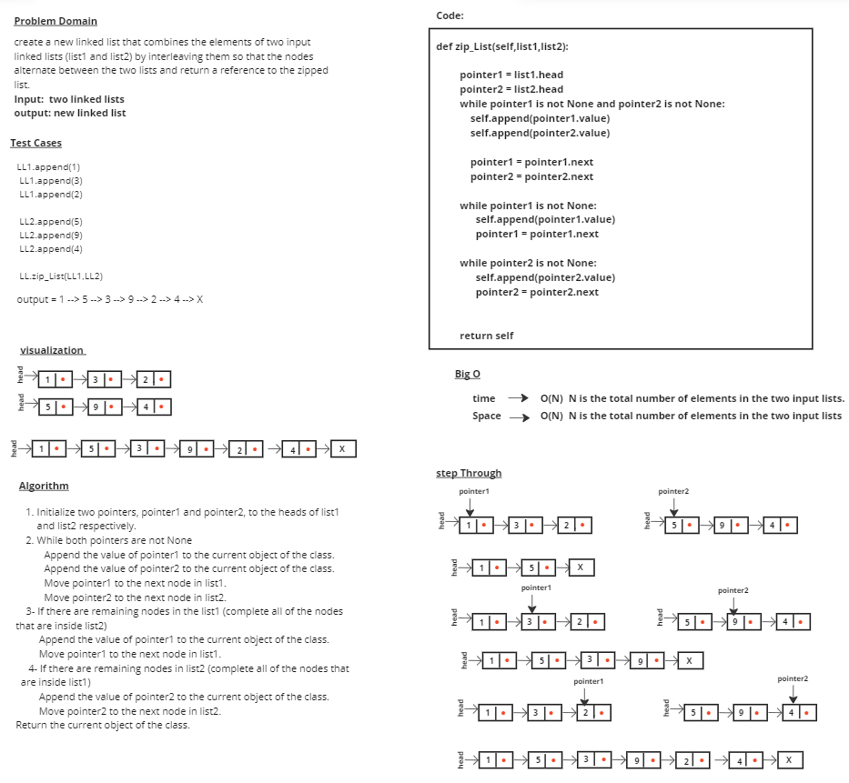

# linked-list-kth

# Whiteboard Process

# Approach & Efficiency
### 1- Initialize two pointers, pointer1 and pointer2, to the heads of list1 and list2 respectively.
### 2- While both pointers are not None
           Append the value of pointer1 to the current object of the class.
           Append the value of pointer2 to the current object of the class.
           Move pointer1 to the next node in list1.
           Move pointer2 to the next node in list2.
### 3- If there are remaining nodes in the list1 (complete all of the nodes that are inside list2)
           Append the value of pointer1 to the current object of the class.
           Move pointer1 to the next node in list1.
### 4- If there are remaining nodes in list2 (complete all of the nodes that   are inside list1)
           Append the value of pointer2 to the current object of the class.
           Move pointer2 to the next node in list2.
### 5- Return the current object of the class.

## time --> O(N)
## Space --> O(N) 

# Solution

## LL1.append(1)
## LL1.append(3)
## LL1.append(2)

## LL2.append(5)
## LL2.append(9)
## LL2.append(4)

## LL.zip_List(LL1,LL2)

## output = 1 --> 5 --> 3 --> 9 --> 2 --> 4 --> X